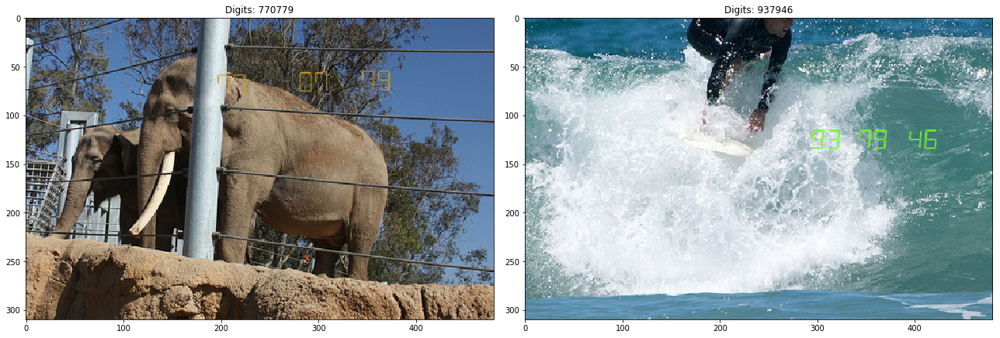
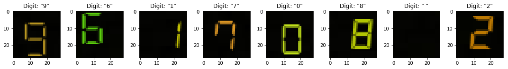
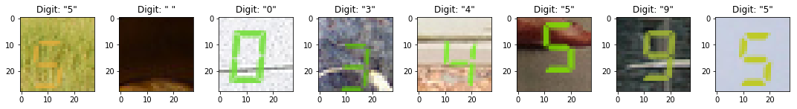
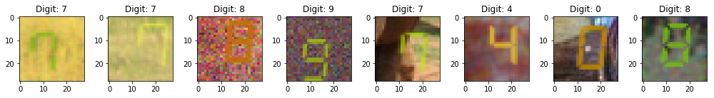
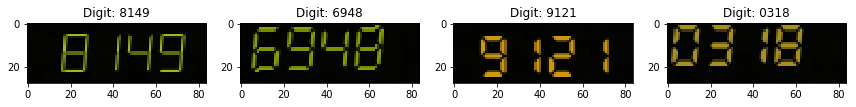

# date_detection

*Read date stamps on noisy images.*

This is a ongoing project with a colleague and is developed on Gitlab. 
Sometimes I publish some models here. 

# TrainingDataGeneration

 
Typical example image:

* large image,
* small date stamp somewhere in the image (in reality this is always in corner),
* noisy data (blur, vintage filter, random gaussian noise)

Many parts are already working, nevertheless I split the problem in smaller parts:

### 1 Single digit 

#### 1.1 MNIST-like images

#### 1.2 MNIST-like images with colorful background

#### 1.3 MNIST-like images with colorful background and noise

### 2 Multi-digit 

#### 2.1 MNIST-like

